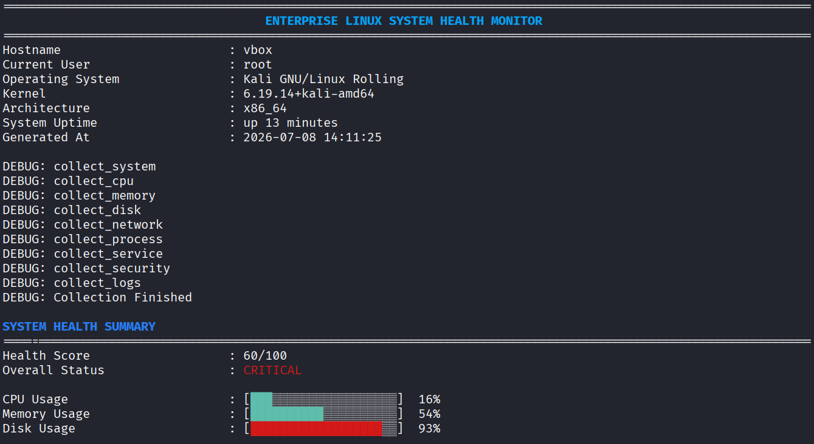
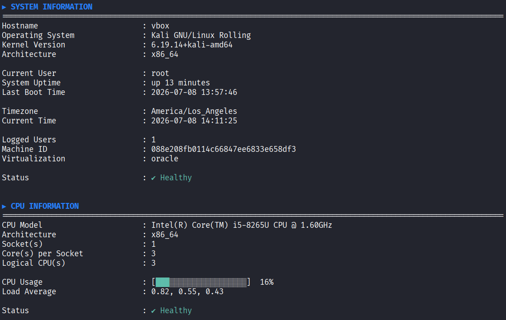
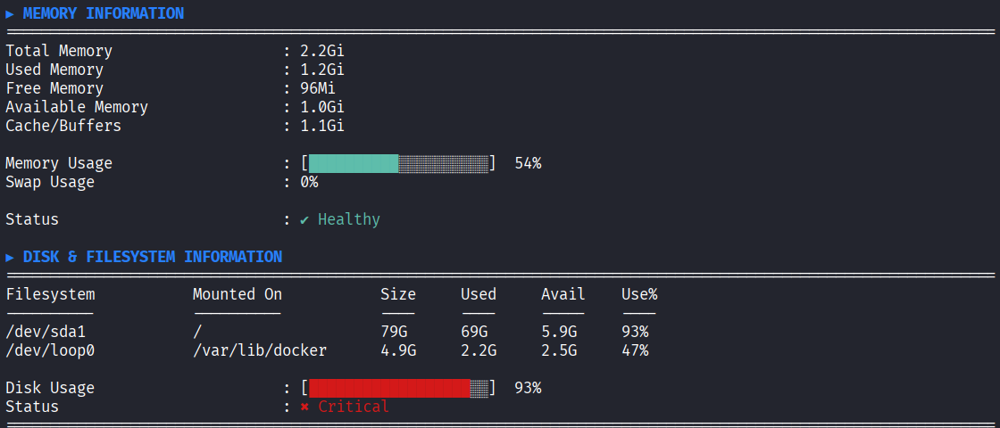
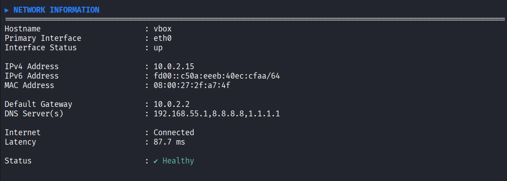
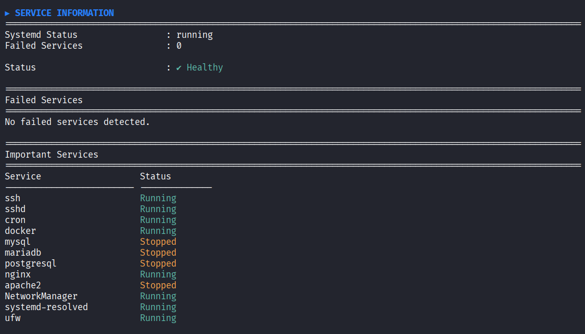
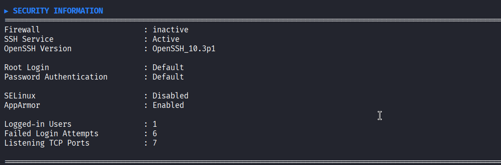
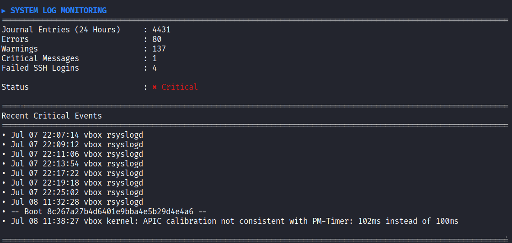
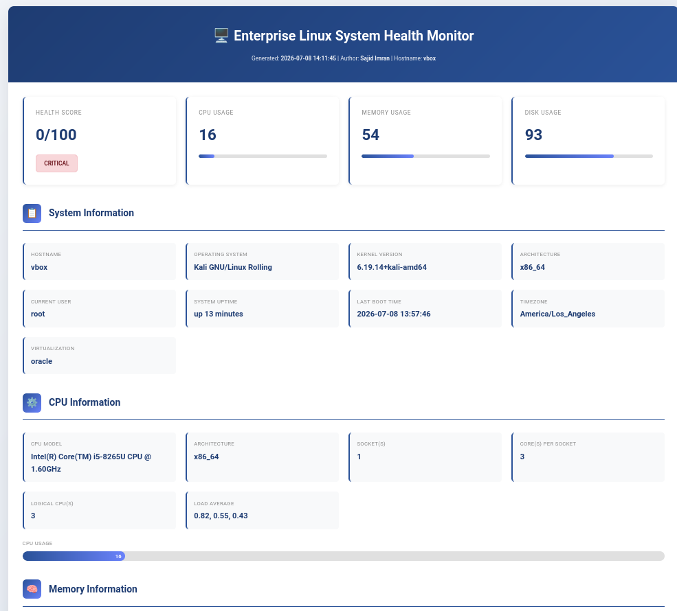

# Enterprise Linux System Health Monitor (ELSHM)

A modular **Bash-based Linux System Health Monitoring** tool that collects, analyzes, and reports the health status of a Linux system. The project provides a colorful terminal dashboard along with an HTML report to help Linux administrators monitor system performance, services, security, and logs.

---

# Features

- System Information
- CPU Monitoring
- Memory Monitoring
- Disk & Filesystem Monitoring
- Network Monitoring
- Process Monitoring
- Service Monitoring
- Security Monitoring
- System Log Monitoring
- Overall Health Score
- HTML Report Generation
- Colorized Terminal Dashboard
- Logging Support
- Modular Architecture

---

# Technologies Used

- Bash Shell
- Linux (Kali Linux)
- GNU Awk
- sed
- grep
- systemctl
- journalctl
- ss
- HTML
- CSS

---

# Project Structure

```text
enterprise-linux-system-health-monitor/

├── bin/
│   └── elshm
├── config/
│   └── monitor.conf
├── dashboard/
│   └── dashboard.sh
├── lib/
│   ├── config.sh
│   ├── health.sh
│   ├── logger.sh
│   └── ui.sh
├── logs/
├── modules/
│   ├── cpu.sh
│   ├── disk.sh
│   ├── logs.sh
│   ├── memory.sh
│   ├── network.sh
│   ├── process.sh
│   ├── security.sh
│   ├── service.sh
│   └── system_info.sh
├── reports/
├── screenshots/
├── tests/
├── CHANGELOG.md
├── CONTRIBUTING.md
├── LICENSE
├── README.md
├── main.sh
└── report.sh
```

---

# Modules

The project consists of the following monitoring modules:

- System Information
- CPU Monitoring
- Memory Monitoring
- Disk Monitoring
- Network Monitoring
- Process Monitoring
- Service Monitoring
- Security Monitoring
- Log Monitoring

---

# Requirements

- Linux (Tested on Kali Linux)
- Bash
- GNU Awk
- systemd
- journalctl
- ss
- sudo privileges

---

# Installation

Clone the repository:

```bash
git clone https://github.com/sjdimn38-eng/enterprise-linux-system-health-monitor.git

cd enterprise-linux-system-health-monitor
```

Make all scripts executable:

```bash
chmod +x main.sh
chmod +x report.sh
chmod +x bin/elshm
chmod +x modules/*.sh
chmod +x lib/*.sh
chmod +x dashboard/*.sh
```

Run the application:

```bash
sudo ./main.sh
```

---

# Sample Output

The application displays:

- System Health Dashboard
- Overall Health Score
- CPU Usage
- Memory Usage
- Disk Usage
- Network Information
- Running Services
- Security Information
- System Log Analysis

It also generates a complete HTML report inside the **reports/** directory.

---

# Screenshots

## Dashboard



---

## System Information



---

## Memory Information



---

## Network Information



---

## Service Information



---

## Security Monitoring



---

## System Log Monitoring



---

## HTML Report


---

# Future Improvements

- Email Alerts
- Real-Time Monitoring
- Docker Container Monitoring
- Prometheus Integration
- Grafana Dashboard
- Slack Notifications
- Email Notifications
- PDF Report Generation

---

# Author

**Sajid Imran**

Linux System Administrator | IT Support Engineer | Cybersecurity Enthusiast | Bash Scripting

GitHub:
https://github.com/sjdimn38-eng

---

# License

This project is licensed under the MIT License.
